# <table align="center"><tr><td valign="center"></td><td valign="center"><a href="https://puzzle-bitcoin.com" target="_blank">Bitcoin Puzzle 66</a></td></tr></table>

This application allows everyone to contribute to solving the Bitcoin Puzzle 66. 
The winner will have access to the private key of a wallet of 6.6 BTC.

<h2>History</h2>&emsp;Discover how this game was created.

<table align="center">
  <tr>
    <td valign="center" align="center">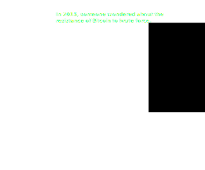</td>
    <td valign="center" align="center">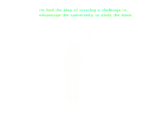</td>
  </tr>
</table>
<table align="center">
  <tr>
    <td valign="center" align="center">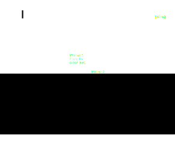</td>
    <td valign="center" align="center">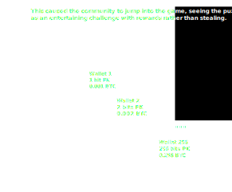</td>
  </tr>
</table>
<table align="center">
  <tr>
    <td valign="center" align="center">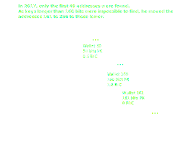</td>
    <td valign="center" align="center">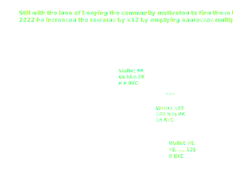</td>
  </tr>
</table>
  
Today, there are 75 unsolved puzzles containing 6.6 to 16 BTC. 
This is why we offer, through this application, a way to participate in a community way in solving puzzle 66. 
There is no longer any need to have GPU to participate, here we use GPUs from the DePIN Golem Network. 
Simply buy a ticket at 0.6 GLM to have a batch of private keys (chunk) scanned and have your chance of winning 6.6 BTC. 
The cost of 0.6 GLM is used to pay GPU providers for the work done. 

<h2>How it works</h2>&emsp;Discover what's happening in the background.

We know that the private key of Puzzle #66 is a number between 2^65 and 2^66-1. 
This keyspace can be divided into 8388608 chunks of 0x40000000000 keys. 
 
Chunk analyse lasts 15 minutes on RTX4090 GPU. 
If we decided to look for the key by scanning all chunks on a single GPU, we would have to: 
8388608 * 15 min = 125829120 min = 2097152 h = 87381 d 
 
This is why we use Golem Network which allows us to perform computations on decentralized GPUs in a parallel way.  

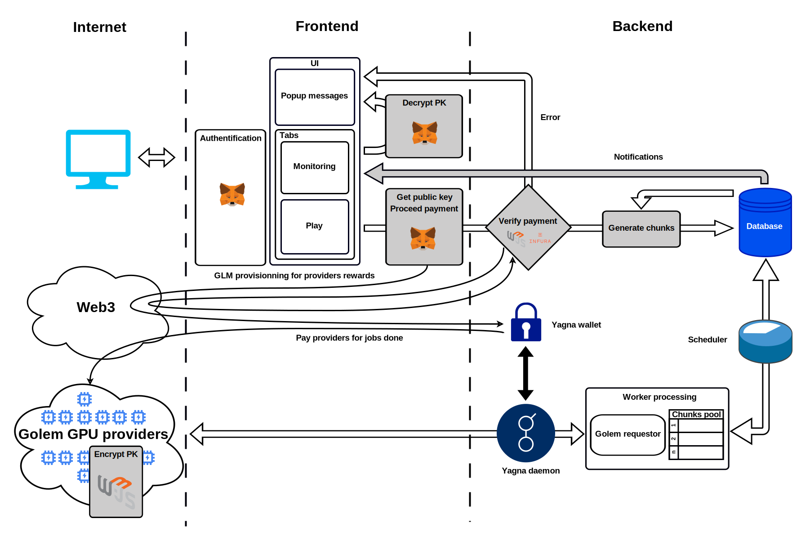 

<h2>How to use</h2>&emsp;Some explanations.

A progress bar for Puzzle 66 is present at the top of the page.  
It describes the global progress with the following properties:
- total chunk number of the puzzle
- number of chunks already scanned
- number of chunks being scanned
- number of waiting chunks

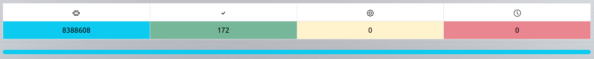 

  
This application use GLM token on Polygon network through Metamask, so you will need: 
<ul>
<li>desktop computer</li>
<li>browser with Metamask extension</li>
<li>Metamask wallet with GLM and MATIC (gas) on Polygon network</li>
</ul>
  
First, select your wallet on Metamash then switch to Play tab and connect/authenticate. 
Metamask will ask confirmations for connection, switching to Polygon network and signature for authentification process. 

<table align="center">
  <tr>
    <td valign="center">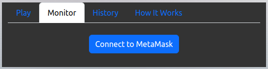</td>
    <td valign="center">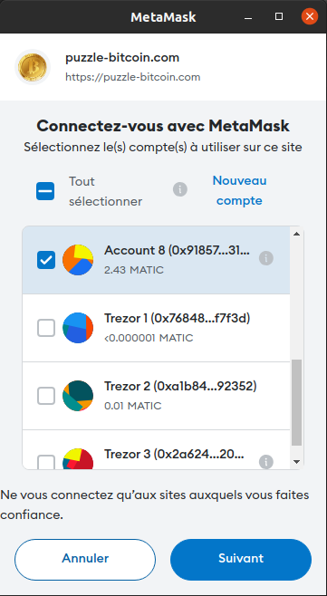</td>
    <td valign="center">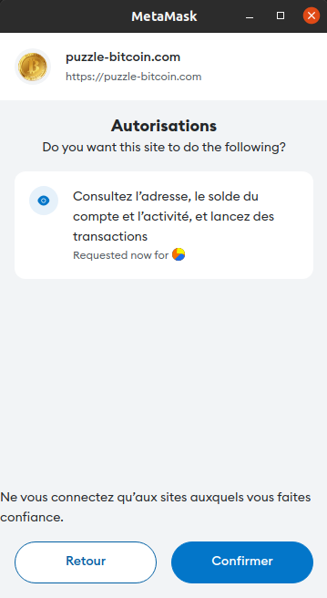</td>
    <td valign="center">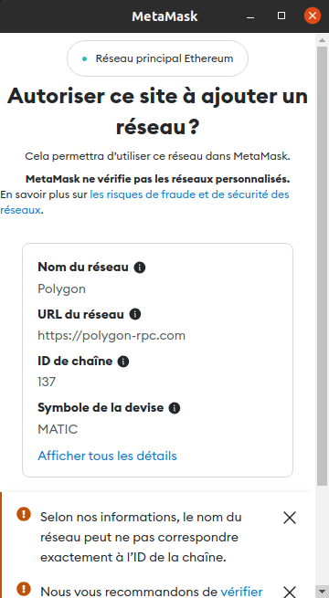</td>
    <td valign="center">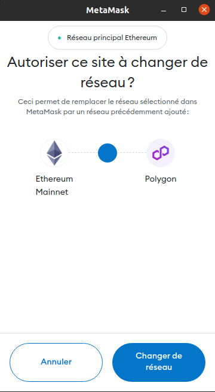</td>
    <td valign="center">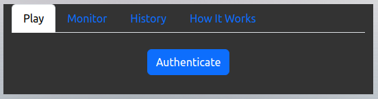</td>
    <td valign="center">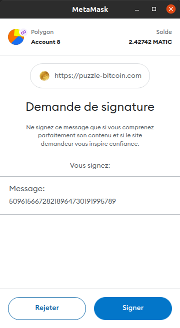</td>
  </tr>
</table>

There are 5 modes available:

- Test by replaying one of the old Puzzles (1 to 65) with chunk preconfiguration.
- Puzzle 66 with random selection of chunks.
- Puzzle 66 with increasing selection of chunks from a starting chunk.
- Any BTC address with random selection of chunks.
- Any BTC address with increasing selection of chunks from a starting chunk.

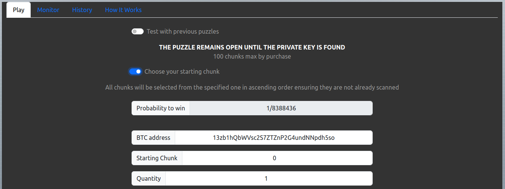 

Only chunks played on the Puzzle 66 are tracked in the database, chunks already scanned are excluded from the selection.  
The table at the bottom of the page allows you to view the cost associated with the selection as well as the balances of your wallet.

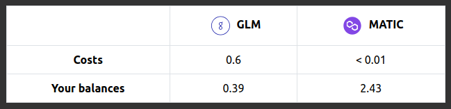 

Once the selection is complete, you can click on the button.  

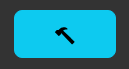 

A first metamask window will open asking for payment confirmation.  
The second Metamask window will ask you for access to your public key to encrypt the keys you will find.  

<table align="center">
  <tr>
    <td valign="center" align="center">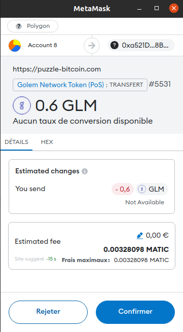</td>
    <td valign="center" align="center">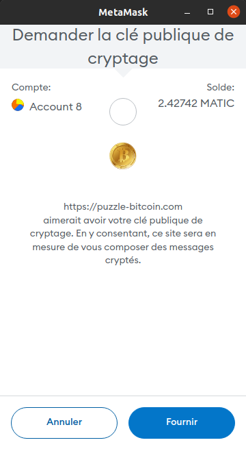</td>
  </tr>
</table>

A popup will indicate the status of payment validation by the server.

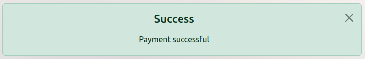 

The chunks will be saved in the database and work will start as soon as validation is completed.  
You will then be automatically redirected to the monitoring tab to follow the progress of the jobs.  
 
You can monitor chunk computations in real time from this panel.  

A summary of your personal statistics on Puzzle 66 appears at the top of the Monitor tab:
- date and quantity of chunks of your last game
- total number of chunks played, number of chunks currently scanning and waiting.

Waiting and computing chunks can be displayed in detail by clicking on them.  

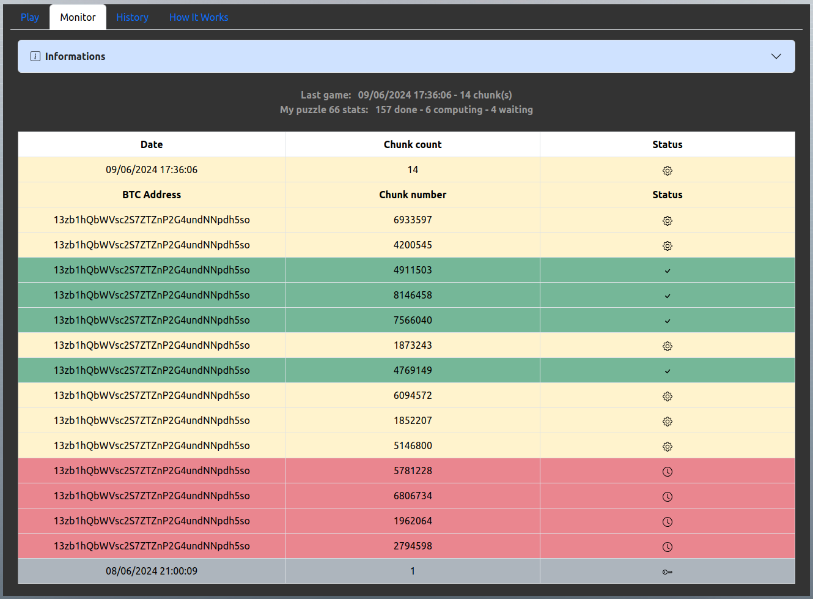 

The keys found by the providers are encrypted with your public key before being uploaded to this server.  
They remain available in this table even after disconnection.  
To recover the found keys, click on them to decrypt and view them.  

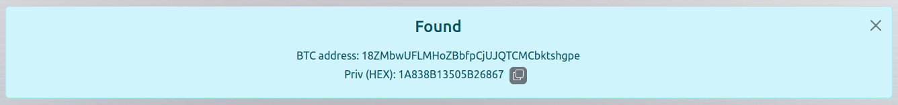 

Inconclusive chunks disappear after computation.

<h2>Notes</h2>

<ul>
<li>Use a wallet with little assets to limit risks, for example 2 MATIC and 20 GLM for few games.</li>
<li>You can buy easily GLM & MATIC tokens on the Golem Onboarding portail <a href="https://glm.golem.network/#/onboarding/budget" target="_blank">https://glm.golem.network/#/onboarding/budget</a>.</li>
<li>Each game is limited to 100 chunks max.</li>
<li>Currently only RTX3090 and RTX4090 GPUs are used, other hardware will be added later. To be requested by this application, a GPU provider must be less than 0.6 GLM for 15 minutes of work on the RTX4090 and 30 minutes on the RTX3090, and have a reputation score of 100%.</li>
<li>The remuneration offered to GPU providers is attractive enough to encourage GPU owners to make them available on the Golem Network and thus increase processing capacity.</li>
<li>The software used to scan chunk on GPU providers is RotorCuda https://github.com/Vladimir855/Rotor-Cuda (fork). </li>
<li>A binary file is used to track chunks played in addition of the database for performance purpose. This file is used by a binary code to generate chunks number randomly or not ensuring they are not already scanned.</li>
<li>Requestor code contains multiple TaskExecutor instances, two for each GPU type used, one for checking available providers discovering and the other as worker. In this way, we optimise tasks scheduling in time and costs aspects.</li>
<li>Use the compressed format for non Puzzle 66 BTC address.</li>
</ul>

